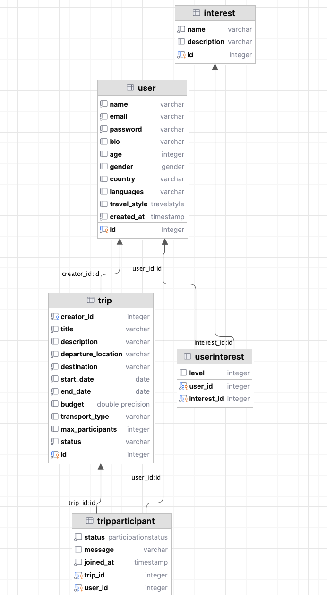
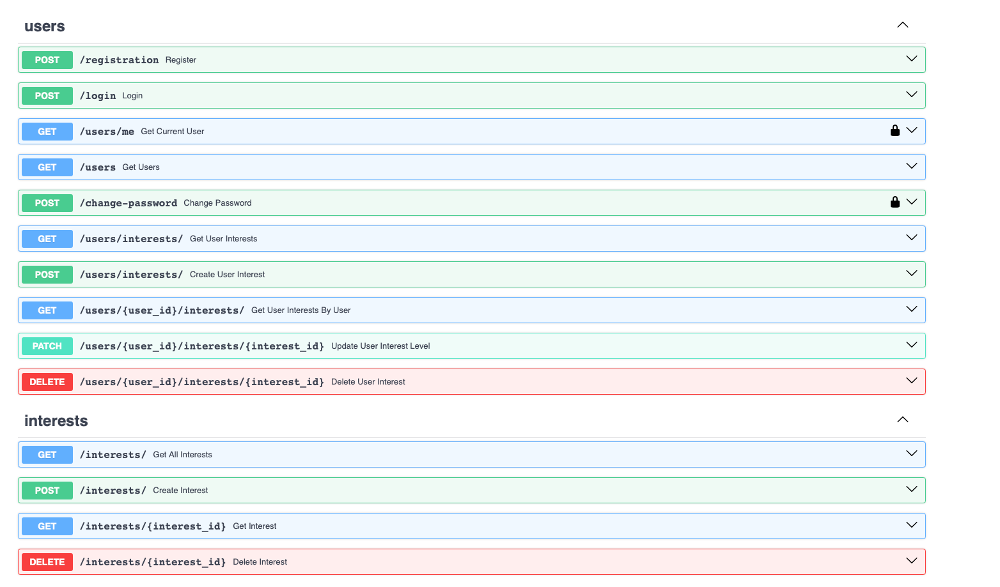
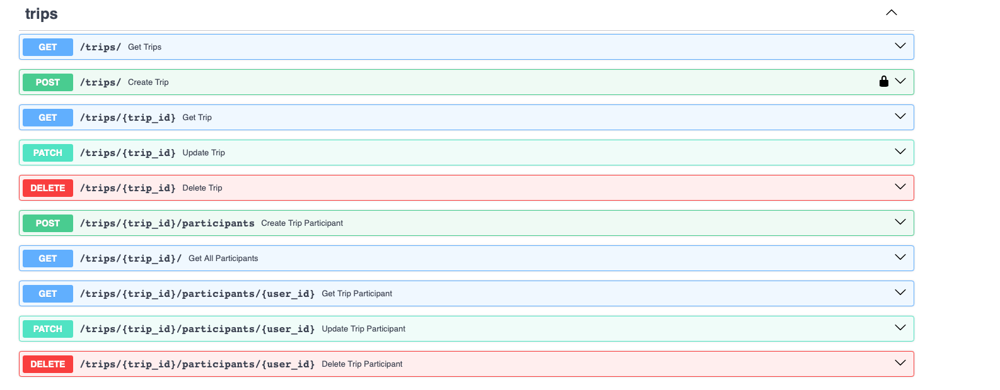

# Лабораторная работа 1. Реализация серверного приложения FastAPI

## Тема:
Разработка веб-приложения для поиска партнеров в путешествие.

# Ход работы:
Схема базы данных:


Файл `models.py`
```python
from typing import Optional, List
from datetime import date, datetime
from enum import Enum

from sqlmodel import SQLModel, Field, Relationship


class Gender(Enum):
    male = "male"
    female = "female"
    other = "other"


class TravelStyle(Enum):
    adventure = "adventure"
    comfort = "comfort"
    cultural = "cultural"
    party = "party"
    nature = "nature"


class User(SQLModel, table=True):
    id: Optional[int] = Field(default=None, primary_key=True)
    name: str
    email: str
    password: str
    bio: Optional[str] = None
    age: Optional[int] = None
    gender: Optional[Gender] = None
    country: Optional[str] = None
    languages: Optional[str] = None  # Comma-separated string
    travel_style: Optional[TravelStyle] = None
    created_at: datetime = Field(default_factory=datetime.utcnow)

    trips_created: List["Trip"] = Relationship(back_populates="creator")
    trip_requests: List["TripParticipant"] = Relationship(back_populates="user")
    user_interests: List["UserInterest"] = Relationship(back_populates="user")


class Trip(SQLModel, table=True):
    id: Optional[int] = Field(default=None, primary_key=True)
    creator_id: int = Field(foreign_key="user.id")
    title: str
    description: Optional[str] = None
    departure_location: str
    destination: str
    start_date: date
    end_date: date
    budget: Optional[float] = None
    transport_type: Optional[str] = None
    max_participants: Optional[int] = None
    status: str = "active"

    creator: Optional[User] = Relationship(back_populates="trips_created")
    participants: List["TripParticipant"] = Relationship(back_populates="trip")


class ParticipationStatus(Enum):
    pending = "pending"
    approved = "approved"
    rejected = "rejected"


class TripParticipant(SQLModel, table=True):
    trip_id: int = Field(foreign_key="trip.id", primary_key=True)
    user_id: int = Field(foreign_key="user.id", primary_key=True)
    status: ParticipationStatus = ParticipationStatus.pending
    message: Optional[str] = None
    joined_at: datetime = Field(default_factory=datetime.utcnow)

    user: Optional[User] = Relationship(back_populates="trip_requests")
    trip: Optional[Trip] = Relationship(back_populates="participants")


class Interest(SQLModel, table=True):
    id: Optional[int] = Field(default=None, primary_key=True)
    name: str
    description: Optional[str] = None

    users: List["UserInterest"] = Relationship(back_populates="interest")


class UserInterest(SQLModel, table=True):
    user_id: int = Field(foreign_key="user.id", primary_key=True)
    interest_id: int = Field(foreign_key="interest.id", primary_key=True)
    level: Optional[int] = None  # 1 to 5, как сильно интересуется темой

    user: Optional[User] = Relationship(back_populates="user_interests")
    interest: Optional[Interest] = Relationship(back_populates="users")

```

Файл `connection.py`

```python
import os

from dotenv import load_dotenv
from sqlmodel import SQLModel, Session, create_engine

load_dotenv()
db_url = os.getenv('DB_URL')
engine = create_engine(db_url, echo=True)


def init_db():
    SQLModel.metadata.create_all(engine)


def get_session():
    with Session(engine) as session:
        yield session

```

Файл `trip_endpoints.py`

```python
from fastapi import APIRouter, Depends, HTTPException
from sqlmodel import Session, select
from typing import List

from db.connection import get_session
from model.models.models import Trip, User, TripParticipant
from model.schemas.trip import TripCreate, TripRead, TripUpdate
from auth.auth import AuthHandler
from model.schemas.trip_participant import TripParticipantCreate, TripParticipantRead, TripParticipantUpdate

trip_router = APIRouter()
auth_handler = AuthHandler()


@trip_router.post("/", response_model=TripRead)
def create_trip(
    trip: TripCreate,
    session: Session = Depends(get_session),
    current_user: User = Depends(auth_handler.get_current_user)
):
    db_trip = Trip(**trip.model_dump(), creator_id=current_user.id)
    session.add(db_trip)
    session.commit()
    session.refresh(db_trip)
    return db_trip


@trip_router.get("/", response_model=List[TripRead])
def get_trips(session: Session = Depends(get_session)):
    return session.exec(select(Trip)).all()


@trip_router.get("/{trip_id}", response_model=TripRead)
def get_trip(trip_id: int, session: Session = Depends(get_session)):
    trip = session.get(Trip, trip_id)
    if not trip:
        raise HTTPException(status_code=404, detail="Trip not found")
    return trip


@trip_router.patch("/{trip_id}", response_model=TripRead)
def update_trip(trip_id: int, update: TripUpdate, session: Session = Depends(get_session)):
    trip = session.get(Trip, trip_id)
    if not trip:
        raise HTTPException(status_code=404, detail="Trip not found")
    update_data = update.model_dump(exclude_unset=True)
    for key, value in update_data.items():
        setattr(trip, key, value)
    session.commit()
    session.refresh(trip)
    return trip


@trip_router.delete("/{trip_id}", response_model=dict)
def delete_trip(trip_id: int, session: Session = Depends(get_session)):
    trip = session.get(Trip, trip_id)
    if not trip:
        raise HTTPException(status_code=404, detail="Trip not found")
    session.delete(trip)
    session.commit()
    return {"ok": True}


@trip_router.post("/{trip_id}/participants", response_model=TripParticipantRead)
def create_trip_participant(trip_id: int, data: TripParticipantCreate, session: Session = Depends(get_session)):
    participant = TripParticipant(
        trip_id=trip_id,
        user_id=data.user_id,
        message=data.message
    )
    session.add(participant)
    session.commit()
    session.refresh(participant)
    return participant


@trip_router.get("/{trip_id}/", response_model=List[TripParticipantRead])
def get_all_participants(trip_id: int, session: Session = Depends(get_session)):
    return session.exec(select(TripParticipant).where(TripParticipant.trip_id == trip_id)).all()


@trip_router.get("/{trip_id}/participants/{user_id}", response_model=TripParticipantRead)
def get_trip_participant(trip_id: int, user_id: int, session: Session = Depends(get_session)):
    participant = session.get(TripParticipant, (trip_id, user_id))
    if not participant:
        raise HTTPException(status_code=404, detail="Participant not found")
    return participant


@trip_router.patch("/{trip_id}/participants/{user_id}", response_model=TripParticipantRead)
def update_trip_participant(trip_id: int, user_id: int, update: TripParticipantUpdate, session: Session = Depends(get_session)):
    participant = session.get(TripParticipant, (trip_id, user_id))
    if not participant:
        raise HTTPException(status_code=404, detail="Participant not found")
    update_data = update.model_dump(exclude_unset=True)
    for key, value in update_data.items():
        setattr(participant, key, value)
    session.commit()
    session.refresh(participant)
    return participant


@trip_router.delete("/{trip_id}/participants/{user_id}", response_model=dict)
def delete_trip_participant(trip_id: int, user_id: int, session: Session = Depends(get_session)):
    participant = session.get(TripParticipant, (trip_id, user_id))
    if not participant:
        raise HTTPException(status_code=404, detail="Participant not found")
    session.delete(participant)
    session.commit()
    return {"ok": True}
```

Файл `schemas.trip.py`

```python
from datetime import date
from typing import Optional

from pydantic import BaseModel
from typing_extensions import List

from model.schemas.trip_participant import TripParticipantRead
from model.schemas.user import UserRead


class TripBase(BaseModel):
    title: str
    description: Optional[str] = None
    departure_location: str
    destination: str
    start_date: date
    end_date: date
    budget: Optional[float] = None
    transport_type: Optional[str] = None
    max_participants: Optional[int] = None
    status: Optional[str] = "active"


class TripCreate(TripBase):
    pass


class TripUpdate(BaseModel):
    title: Optional[str] = None
    description: Optional[str] = None
    departure_location: Optional[str] = None
    destination: Optional[str] = None
    start_date: Optional[date] = None
    end_date: Optional[date] = None
    budget: Optional[float] = None
    transport_type: Optional[str] = None
    max_participants: Optional[int] = None
    status: Optional[str] = None


class TripRead(TripBase):
    id: int
    creator_id: int
    creator: Optional[UserRead] = None
    participants: List[TripParticipantRead] = None

```

Эндпоинты в Swagger

