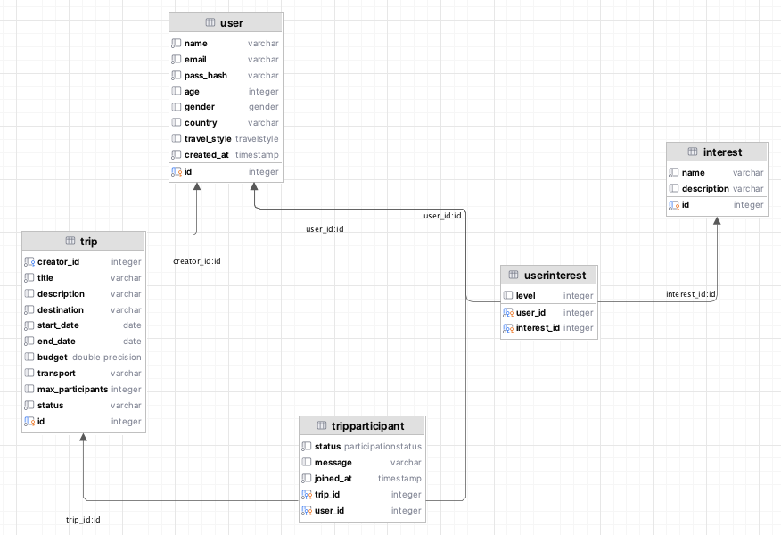
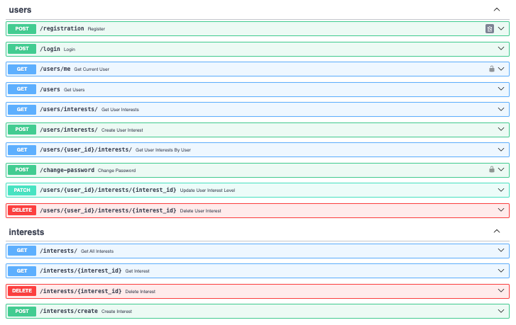
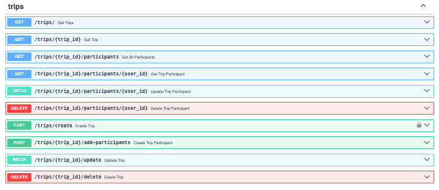
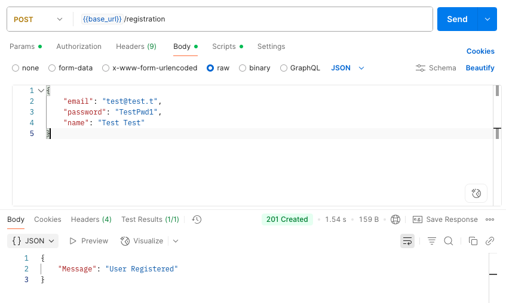
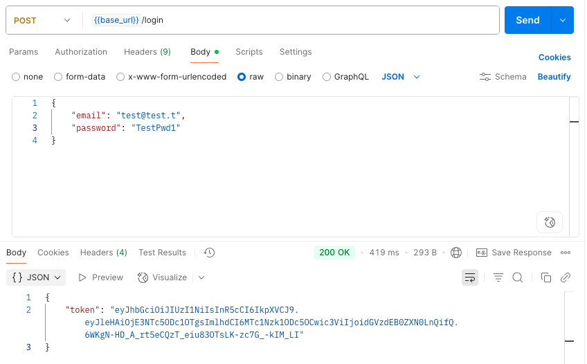

# Лабораторная работа 1. Реализация серверного приложения FastAPI

## Тема:
Разработка веб-приложения для поиска партнеров в путешествие.

## Ход работы:
Схема базы данных:


Модели описаны в файле `models.py`
```python
from typing import Optional, List
from datetime import date, datetime
from enum import Enum

from sqlmodel import SQLModel, Field, Relationship


# Enums for better usability
class Gender(Enum):
    male = "Male"
    female = "Female"
    other = "Other"

class TravelStyle(Enum):
    camping = "Camping"
    active = "Active"
    cultural = "Cultural"
    comfort = "Comfort"

class ParticipationStatus(Enum):
    pending = "pending"
    approved = "approved"
    rejected = "rejected"

# Models
class User(SQLModel, table=True):
    id: Optional[int] = Field(default=None, primary_key=True)
    name: str
    email: str
    pass_hash: str
    age: Optional[int] = None
    gender: Optional[Gender] = None
    country: Optional[str] = None
    travel_style: Optional[TravelStyle] = None
    created_at: datetime = Field(default_factory=datetime.utcnow)

    trips_created: List["Trip"] = Relationship(back_populates="creator")
    trip_requests: List["TripParticipant"] = Relationship(back_populates="user")
    user_interests: List["UserInterest"] = Relationship(back_populates="user")


class Interest(SQLModel, table=True):
    id: Optional[int] = Field(default=None, primary_key=True)
    name: str
    description: Optional[str] = None

    users: List["UserInterest"] = Relationship(back_populates="interest")


class Trip(SQLModel, table=True):
    id: Optional[int] = Field(default=None, primary_key=True)
    creator_id: int = Field(foreign_key="user.id")
    title: str
    description: Optional[str] = None
    destination: str
    start_date: date
    end_date: date
    budget: Optional[float] = None
    transport: Optional[str] = None
    max_participants: Optional[int] = None
    status: str = "active"

    creator: Optional[User] = Relationship(back_populates="trips_created")
    participants: List["TripParticipant"] = Relationship(back_populates="trip")


class TripParticipant(SQLModel, table=True):
    trip_id: int = Field(foreign_key="trip.id", primary_key=True)
    user_id: int = Field(foreign_key="user.id", primary_key=True)
    status: ParticipationStatus = ParticipationStatus.pending
    message: Optional[str] = None
    joined_at: datetime = Field(default_factory=datetime.utcnow)

    user: Optional[User] = Relationship(back_populates="trip_requests")
    trip: Optional[Trip] = Relationship(back_populates="participants")


class UserInterest(SQLModel, table=True):
    user_id: int = Field(foreign_key="user.id", primary_key=True)
    interest_id: int = Field(foreign_key="interest.id", primary_key=True)
    level: Optional[int] = None

    user: Optional[User] = Relationship(back_populates="user_interests")
    interest: Optional[Interest] = Relationship(back_populates="users")

```

Подключение к БД в файле `connection.py`

```python
from sqlmodel import SQLModel, Session, create_engine

DB_USERNAME = "entityfrm"
DB_PASSWORD = "pP3VJsoAcX2q"
DB_HOST = "ep-mute-sun-a2woi1rv-pooler.eu-central-1.aws.neon.tech"
DB_PORT = "5432"
DB_NAME = "web_dev_sem_6"

DATABASE_URL = f"postgresql://{DB_USERNAME}:{DB_PASSWORD}@{DB_HOST}:{DB_PORT}/{DB_NAME}?sslmode=require&channel_binding=require"

engine = create_engine(DATABASE_URL) # , echo=True

def init_db():
    SQLModel.metadata.create_all(engine)

def get_session():
    with Session(engine) as session:
        yield session

```

## API Эндпоинты 

Файл `user_endpoints.py`

```python
from fastapi import APIRouter, HTTPException, Depends
from sqlmodel import Session, select
from starlette.responses import JSONResponse
from starlette.status import HTTP_201_CREATED
from typing_extensions import List

from lab_1.auth.auth import AuthService
from lab_1.db.connection import get_session
from lab_1.model.models.models import User, UserInterest
from lab_1.model.schemas.user import UserCreate, UserLogin, UserRead, UserPasswordChange
from lab_1.model.schemas.user_interest import UserInterestRead, UserInterestCreate
from lab_1.repos.user_repos import select_all_users, find_user

user_router = APIRouter()
auth_handler = AuthService()


# ------ AUTH ------

@user_router.post('/registration', status_code=201, tags=['users'],
                  description='Register new user')
def register(user: UserCreate, session=Depends(get_session)):
    users = select_all_users()
    if any(u.email == user.email for u in users):
        raise HTTPException(status_code=400, detail='Email is taken')
    hashed_pwd = auth_handler.get_password_hash(user.password)
    print(f'hashed_pwd: {hashed_pwd}')
    u = User(email=user.email, pass_hash=hashed_pwd, name=user.name)
    session.add(u)
    session.commit()
    return JSONResponse(status_code=HTTP_201_CREATED, content={"Message": "User Registered"})

@user_router.post('/login', tags=['users'])
def login(user: UserLogin):
    user_found = find_user(user.email)
    if not user_found:
        raise HTTPException(status_code=401, detail='Invalid email and/or password')
    verified = auth_handler.verify_password(user.password, user_found.pass_hash)
    if not verified:
        raise HTTPException(status_code=401, detail='Invalid email and/or password')
    token = auth_handler.encode_token(user_found.email)
    return {'token': token}


# ------ GET ------

@user_router.get('/users/me', tags=['users'])
def get_current_user(user: User = Depends(auth_handler.get_current_user)):
    return user

@user_router.get("/users", response_model=List[UserRead], tags=['users'])
def get_users(session: Session = Depends(get_session)):
    return session.exec(select(User)).all()

@user_router.get("/users/interests/", response_model=List[UserInterestRead], tags=['users'])
def get_user_interests(session: Session = Depends(get_session)):
    return session.exec(select(UserInterest)).all()

@user_router.get("/users/{user_id}/interests/", response_model=List[UserInterestRead], tags=['users'])
def get_user_interests_by_user(user_id: int, session: Session = Depends(get_session)):
    return session.exec(select(UserInterest).where(UserInterest.user_id == user_id)).all()


# ------ POST ------

@user_router.post("/change-password", tags=['users'])
def change_password(
        data: UserPasswordChange,
        session: Session = Depends(get_session),
        current_user: User = Depends(auth_handler.get_current_user)
):
    if not auth_handler.verify_password(data.old_password, current_user.password):
        raise HTTPException(status_code=400, detail="Incorrect old password")

    current_user.pass_hash = auth_handler.get_password_hash(data.new_password)
    session.add(current_user)
    session.commit()
    return {"message": "Password updated successfully"}

@user_router.post("/users/interests/", response_model=UserInterestRead, tags=['users'])
def create_user_interest(data: UserInterestCreate, session: Session = Depends(get_session)):
    db_interest = UserInterest.model_validate(data)
    session.add(db_interest)
    session.commit()
    session.refresh(db_interest)
    return db_interest


# ------ PATCH ------

@user_router.patch("/users/{user_id}/interests/{interest_id}", response_model=UserInterestRead, tags=['users'])
def update_user_interest_level(user_id: int, interest_id: int, level: int, session: Session = Depends(get_session)):
    relation = session.get(UserInterest, (user_id, interest_id))
    if not relation:
        raise HTTPException(status_code=404, detail="UserInterest not found")
    relation.level = level
    session.add(relation)
    session.commit()
    session.refresh(relation)
    return relation


# ------ DELETE ------

@user_router.delete("/users/{user_id}/interests/{interest_id}", response_model=dict, tags=['users'])
def delete_user_interest(user_id: int, interest_id: int, session: Session = Depends(get_session)):
    relation = session.get(UserInterest, (user_id, interest_id))
    if not relation:
        raise HTTPException(status_code=404, detail="UserInterest not found")
    session.delete(relation)
    session.commit()
    return {"ok": True}
```

Файл `trip_endpoints.py`

```python
from fastapi import APIRouter, Depends, HTTPException
from sqlmodel import Session, select
from typing import List

from lab_1.db.connection import get_session
from lab_1.model.models.models import Trip, User, TripParticipant
from lab_1.model.schemas.trip import TripCreate, TripRead, TripUpdate
from lab_1.auth.auth import AuthService
from lab_1.model.schemas.trip_participant import TripParticipantCreate, TripParticipantRead, TripParticipantUpdate

trip_router = APIRouter()
auth_handler = AuthService()

# ------ GET --------

@trip_router.get("/", response_model=List[TripRead])
def get_trips(session: Session = Depends(get_session)):
    return session.exec(select(Trip)).all()

@trip_router.get("/{trip_id}", response_model=TripRead)
def get_trip(trip_id: int, session: Session = Depends(get_session)):
    trip = session.get(Trip, trip_id)
    if not trip:
        raise HTTPException(status_code=404, detail="Trip not found")
    return trip

@trip_router.get("/{trip_id}/participants", response_model=List[TripParticipantRead])
def get_all_participants(trip_id: int, session: Session = Depends(get_session)):
    return session.exec(select(TripParticipant).where(TripParticipant.trip_id == trip_id)).all()

@trip_router.get("/{trip_id}/participants/{user_id}", response_model=TripParticipantRead)
def get_trip_participant(trip_id: int, user_id: int, session: Session = Depends(get_session)):
    participant = session.get(TripParticipant, (trip_id, user_id))
    if not participant:
        raise HTTPException(status_code=404, detail="Participant not found")
    return participant


# ------ POST ------

@trip_router.post("/create", response_model=TripRead)
def create_trip(
    trip: TripCreate,
    session: Session = Depends(get_session),
    current_user: User = Depends(auth_handler.get_current_user)
):
    db_trip = Trip(**trip.model_dump(), creator_id=current_user.id)
    session.add(db_trip)
    session.commit()
    session.refresh(db_trip)
    return db_trip

@trip_router.post("/{trip_id}/add-participants", response_model=TripParticipantRead)
def create_trip_participant(trip_id: int, data: TripParticipantCreate, session: Session = Depends(get_session)):
    participant = TripParticipant(
        trip_id=trip_id,
        user_id=data.user_id,
        message=data.message
    )
    session.add(participant)
    session.commit()
    session.refresh(participant)
    return participant


# ------ PATCH ------

@trip_router.patch("/{trip_id}/update", response_model=TripRead)
def update_trip(trip_id: int, update: TripUpdate, session: Session = Depends(get_session)):
    trip = session.get(Trip, trip_id)
    if not trip:
        raise HTTPException(status_code=404, detail="Trip not found")
    update_data = update.model_dump(exclude_unset=True)
    for key, value in update_data.items():
        setattr(trip, key, value)
    session.commit()
    session.refresh(trip)
    return trip

@trip_router.patch("/{trip_id}/participants/{user_id}", response_model=TripParticipantRead)
def update_trip_participant(trip_id: int, user_id: int, update: TripParticipantUpdate, session: Session = Depends(get_session)):
    participant = session.get(TripParticipant, (trip_id, user_id))
    if not participant:
        raise HTTPException(status_code=404, detail="Participant not found")
    update_data = update.model_dump(exclude_unset=True)
    for key, value in update_data.items():
        setattr(participant, key, value)
    session.commit()
    session.refresh(participant)
    return participant


# ------ DELETE ------

@trip_router.delete("/{trip_id}/delete", response_model=dict)
def delete_trip(trip_id: int, session: Session = Depends(get_session)):
    trip = session.get(Trip, trip_id)
    if not trip:
        raise HTTPException(status_code=404, detail="Trip not found")
    session.delete(trip)
    session.commit()
    return {"ok": True}

@trip_router.delete("/{trip_id}/participants/{user_id}", response_model=dict)
def delete_trip_participant(trip_id: int, user_id: int, session: Session = Depends(get_session)):
    participant = session.get(TripParticipant, (trip_id, user_id))
    if not participant:
        raise HTTPException(status_code=404, detail="Participant not found")
    session.delete(participant)
    session.commit()
    return {"ok": True}
```

Файл `interest_endpoints.py`

```python
from fastapi import APIRouter, Depends, HTTPException
from sqlmodel import Session, select
from typing import List

from lab_1.db.connection import get_session
from lab_1.model.models.models import Interest, UserInterest
from lab_1.model.schemas.interest import InterestRead, InterestCreate
from lab_1.model.schemas.user_interest import UserInterestRead, UserInterestCreate

interest_router = APIRouter()
user_interest_router = APIRouter()


# ------ GET ------

@interest_router.get("/", response_model=List[InterestRead])
def get_all_interests(session: Session = Depends(get_session)):
    return session.exec(select(Interest)).all()

@interest_router.get("/{interest_id}", response_model=InterestRead)
def get_interest(interest_id: int, session: Session = Depends(get_session)):
    interest = session.get(Interest, interest_id)
    if not interest:
        raise HTTPException(status_code=404, detail="Interest not found")
    return interest


# ------ POST ------

@interest_router.post("/create", response_model=InterestRead)
def create_interest(interest: InterestCreate, session: Session = Depends(get_session)):
    db_interest = Interest.model_validate(interest)
    session.add(db_interest)
    session.commit()
    session.refresh(db_interest)
    return db_interest


# ------DELETE ------

@interest_router.delete("/{interest_id}", response_model=dict)
def delete_interest(interest_id: int, session: Session = Depends(get_session)):
    interest = session.get(Interest, interest_id)
    if not interest:
        raise HTTPException(status_code=404, detail="Interest not found")
    session.delete(interest)
    session.commit()
    return {"ok": True}
```

Эндпоинты в Swagger




## Пример регистрации и логина в Postman


