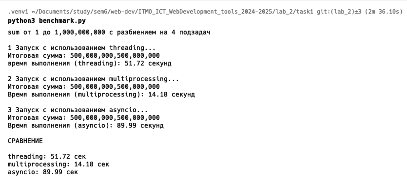
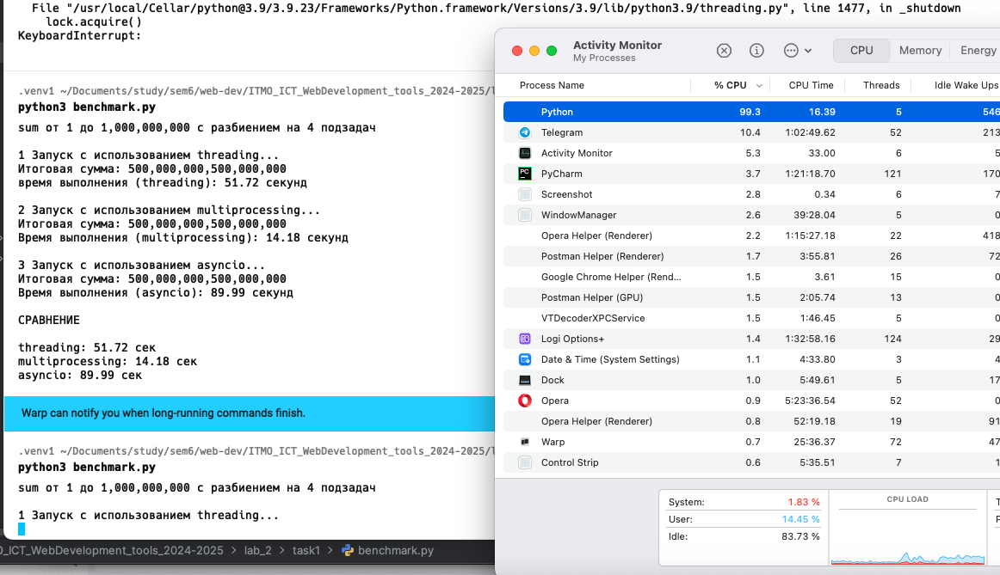
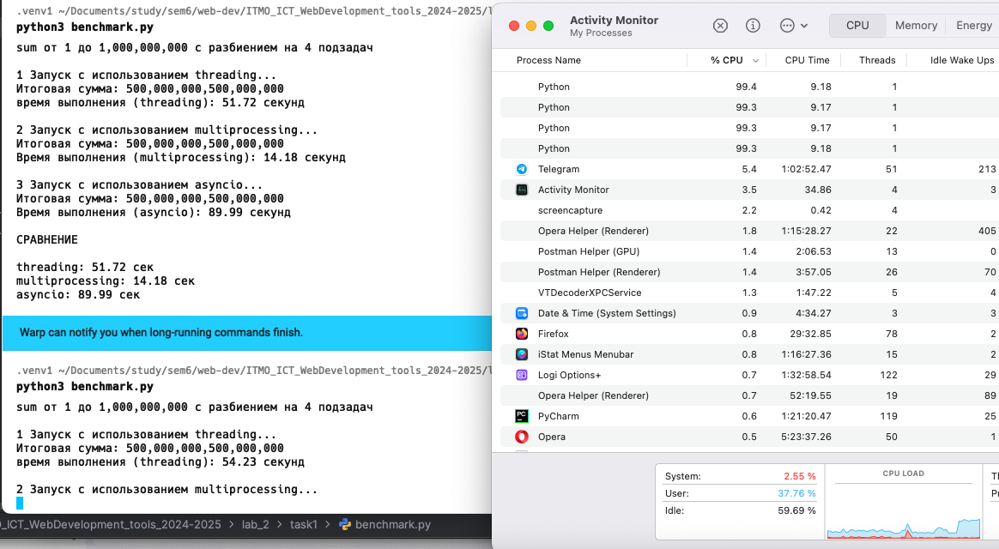
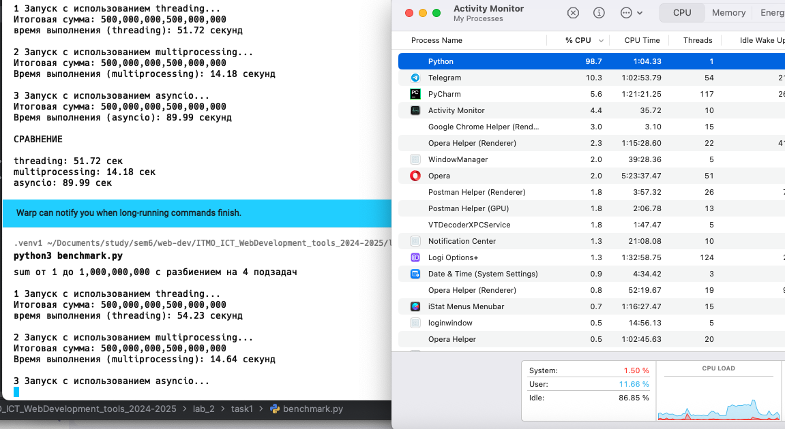
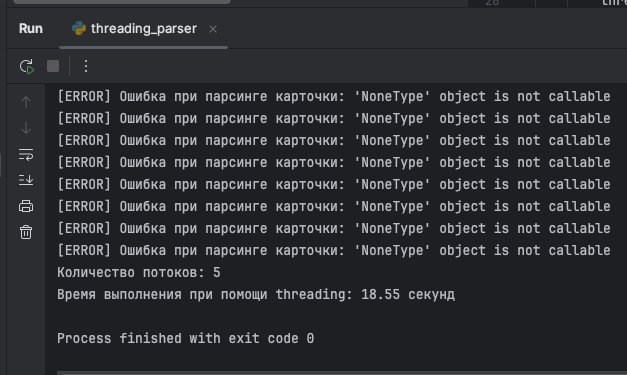
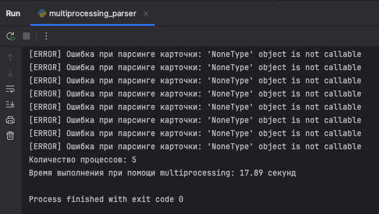
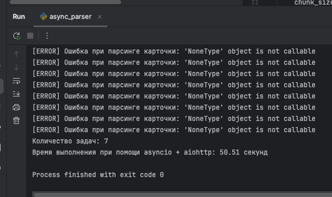

# Лабораторная работа 2. Потоки. Процессы. Асинхронность.
## Ход работы

### Задание 1

#### Сравнение
Файл `benchmark.py`

```python
import asyncio
import threading
import time
import multiprocessing
from concurrent.futures import ThreadPoolExecutor, ProcessPoolExecutor

TARGET = 1_000_000_000
NUM_TASKS = 4

def calculate_sum(start: int, end: int) -> int:
    total = 0
    for i in range(start, end):
        total += i
    return total


# THREADING
def run_threading():
    print("\n1 Запуск с использованием threading...")

    def worker(start, end, results, index):
        results[index] = calculate_sum(start, end)

    chunk_size = TARGET // NUM_TASKS
    threads = []
    results = [0] * NUM_TASKS

    start_time = time.perf_counter()

    for i in range(NUM_TASKS):
        start = i * chunk_size + 1
        end = (i + 1) * chunk_size + 1 if i < NUM_TASKS - 1 else TARGET + 1
        thread = threading.Thread(target=worker, args=(start, end, results, i))
        threads.append(thread)
        thread.start()

    for thread in threads:
        thread.join()

    total_sum = sum(results)
    elapsed = time.perf_counter() - start_time

    print(f"Итоговая сумма: {total_sum:,}")
    print(f"время выполнения (threading): {elapsed:.2f} секунд")
    return elapsed

# MULTIPROCESSING
def run_multiprocessing():
    print("\n2 Запуск с использованием multiprocessing...")

    chunk_size = TARGET // NUM_TASKS
    tasks = []

    start_time = time.perf_counter()

    with multiprocessing.Pool(processes=NUM_TASKS) as pool:
        for i in range(NUM_TASKS):
            start = i * chunk_size + 1
            end = (i + 1) * chunk_size + 1 if i < NUM_TASKS - 1 else TARGET + 1
            tasks.append(pool.apply_async(calculate_sum, (start, end)))

        results = [task.get() for task in tasks]

    total_sum = sum(results)
    elapsed = time.perf_counter() - start_time

    print(f"Итоговая сумма: {total_sum:,}")
    print(f"Время выполнения (multiprocessing): {elapsed:.2f} секунд")
    return elapsed

# ASYNC
async def calculate_sum_async(start: int, end: int) -> int:

    total = 0
    for i in range(start, end):
        total += i
        if i % 10_000_000 == 0:
            await asyncio.sleep(0)
    return total

async def run_async():
    print("\n3 Запуск с использованием asyncio...")

    chunk_size = TARGET // NUM_TASKS
    tasks = []

    start_time = time.perf_counter()

    for i in range(NUM_TASKS):
        start = i * chunk_size + 1
        end = (i + 1) * chunk_size + 1 if i < NUM_TASKS - 1 else TARGET + 1
        tasks.append(calculate_sum_async(start, end))

    results = await asyncio.gather(*tasks)
    total_sum = sum(results)
    elapsed = time.perf_counter() - start_time

    print(f"Итоговая сумма: {total_sum:,}")
    print(f"Время выполнения (asyncio): {elapsed:.2f} секунд")
    return elapsed

if __name__ == "__main__":
    print(f"sum от 1 до {TARGET:,} с разбиением на {NUM_TASKS} подзадач")

    time_threading = run_threading()
    time_multiprocessing = run_multiprocessing()
    time_async = asyncio.run(run_async())

    print("\nСРАВНЕНИЕ\n")
    print(f"threading: {time_threading:.2f} сек")
    print(f"multiprocessing: {time_multiprocessing:.2f} сек")
    print(f"asyncio: {time_async:.2f} сек")
```

Результаты выполнения:


#### Замечания

Стоит отметить, что с помощью Activity Monitor можно увидеть работу всех способов. Самым интересным является
Multiprocessing так как явно видно что он запускает несколько процессов



здесь представлена работа threading



Здесь представлена работа Multiprocessing


Здесь представлена работа asyncio

#### Выводы
- Для CPU-bound задач Python рекомендуется использовать multiprocessing для реального ускорения за счёт параллельной работы на нескольких ядрах процессора.
- Threading и asyncio не дают прироста в чистых вычислениях из-за ограничений GIL и асинхронной природы работы соответственно.

## Задание 2

Одним из требований задания был парсинг страниц для заполнения базы данных. В качестве примера был выбран сайт `auto.ru`
со списком всех машин, доступных в СПб

#### threading

Файл `threading_parser.py`

```python
import threading
import time

import requests

from lab_2.task2.common.parser import process_page
from lab_2.task2.urls import urls


def parse_and_save(url_list):
    for url in url_list:
        response = requests.get(url, timeout=10)
        response.raise_for_status()
        process_page(response.text)


def main():
    num_threads = 5
    start_time = time.time()
    chunk_size = (len(urls) + num_threads - 1) // num_threads
    chunks = [urls[i:i + chunk_size] for i in range(0, len(urls), chunk_size)]

    threads = []
    for chunk in chunks:
        thread = threading.Thread(target=parse_and_save, args=(chunk,))
        threads.append(thread)
        thread.start()

    for thread in threads:
        thread.join()

    print(f"Количество потоков: {num_threads}")
    print(f"Время выполнения при помощи threading: {time.time() - start_time:.2f} секунд")


if __name__ == "__main__":
    main()
```

Результаты выполнения:



#### multiprocessing

Файл `multiprocessing_parser`

```python
import multiprocessing
import time

import requests

from lab_2.task2.common.parser import process_page
from lab_2.task2.urls import urls


def parse_and_save(url_list):
    for url in url_list:
        response = requests.get(url, timeout=10)
        response.raise_for_status()
        process_page(response.text)


def main():
    start_time = time.time()
    num_processes = 5
    chunk_size = (len(urls) + num_processes - 1) // num_processes
    chunks = [urls[i:i + chunk_size] for i in range(0, len(urls), chunk_size)]
    processes = []

    for chunk in chunks:
        process = multiprocessing.Process(target=parse_and_save, args=(chunk,))
        processes.append(process)
        process.start()

    for process in processes:
        process.join()

    print(f"Количество процессов: {num_processes}")
    print(f"multiprocessing: {time.time() - start_time:.2f} секунд")


if __name__ == "__main__":
    main()
```

Результаты выполнения:



#### asyncio + aiohttp

Файл `async_parser.py`

```python
import asyncio
import time

import aiohttp

from lab_2.task2.common.parser import process_page
from lab_2.task2.urls import urls


async def fetch(session, url):
    async with session.get(url, timeout=10, ssl=False) as response:
        text = await response.text()
        return url, text


async def parse_and_save(url):
    async with aiohttp.ClientSession() as session:
        url, html = await fetch(session, url)
        if html:
            process_page(html)

async def parse_chunk(chunk):
    tasks = [parse_and_save(url) for url in chunk]
    await asyncio.gather(*tasks)


async def main():
    num_chunks = 5
    start_time = time.time()

    chunk_size = (len(urls) + num_chunks - 1) // num_chunks
    chunks = [urls[i:i + chunk_size] for i in range(0, len(urls), chunk_size)]

    chunk_tasks = [parse_chunk(chunk) for chunk in chunks]
    await asyncio.gather(*chunk_tasks)

    print(f"Количество задач: {len(urls)}")
    print(f"Время выполнения при помощи asyncio + aiohttp: {time.time() - start_time:.2f} секунд")


if __name__ == "__main__":
    asyncio.run(main())
```

Результаты выполнения:




#### Итоговые результаты
| Подход              | Количество потоков/процессов/задач | Время выполнения |
|:--------------------|:-----------------------------------|:-----------------|
| **Threading**       | 5 потоков                          | 18.55 секунд     |
| **Multiprocessing** | 5 процессов                        | 17.89 секунд     |
| **Asyncio**         | 5 задач                            | 50.51 секунд     |

#### Выводы
- Для небольшого количества сетевых запросов допустимо использовать threading.
- Asyncio все еще остается самым медленным методом